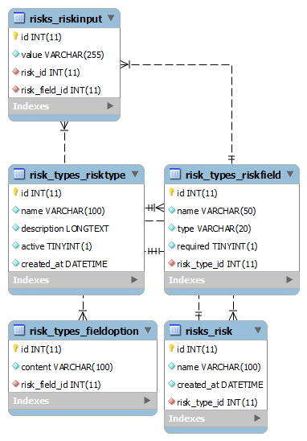

# Insurance System
This is an insurance solution that allows insurers to define their own custom data models for their risks and submit risk entities based on mentioned models.

## Motivation
This project is developed for my assessment for the Software Engineer (Product Development) position at [BriteCore](http://www.britecore.com).

## Description
This project is created using [Django](https://www.djangoproject.com/) and [Django REST framework](https://www.django-rest-framework.org/) for the backend and API, [MySQL](https://www.mysql.com/) as a relational database management system, Vue.js for the Web Client and [BootsrapVue](https://bootstrap-vue.js.org/) (No jQuery included) for the Web UI.

## My Approach

### Backend

The backend project contains two applications described as below:

__risk_types__ - This application contains the business logic related to creating dynamic models and it has 3 database models: Risk Type, RiskField and FieldOption

__risks__ - This application contains the business logic related to submitting data's based on the dynamic models that are created form risk_types, it contains 2 models: Risk which is the pivot table between the entries and the custom models, RiskInputs which contains entries

There are 18 tests on backend with 100% coverage

Below you can find Entity relationship diagram

<p align="center"> 
    
</p>

### Frontend
The frontend is implemented as SPA with VueJS.
Frontend boilerplate is a modification of standard Vue boilerplate (the one that can be generated using Vue CLI), it has services folder which is used for API calls, separated Vuex stores for each module and filters. 

## Deployment Method
I used Zappa to deploy the backend application to [AWS Lambda](https://aws.amazon.com/lambda/), [Aurora Serverless](https://aws.amazon.com/rds/aurora/serverless/) to host the DB and [Amazon S3](https://aws.amazon.com/s3/) for the frontend application.

Deployment is fully scripted using [Travis CI](https://travis-ci.org/) as a hosted CI and CD service.
I used Travis CI to run a pipeline that runs test cases, coverage check, coding style tests for [PEP 8](https://www.python.org/dev/peps/pep-0008) compliance for each git push and deploys automatically to production if the branch is master.

***Note***: 
In order to have the build successfully test coverage condition is specified on [travis.yml](travis.yml) as 100% 

I also created a [Docker Compose](https://docs.docker.com/compose/) file to make easy to setup the development environment for new developers in the project and standardize the development environment so we can have exact environments across developers.

## Build status
Build status of continuous integration

[](https://travis-ci.org/tocilla/Insurance)
[](https://codecov.io/gh/tocilla/Insurance)

## Getting Started

These instructions will get you a copy of the project up and running on your local machine for development and testing purposes. See deployment for notes on how to deploy the project on a live system.

### Prerequisities


In order to run this container, you'll need docker and docker compose installed.

* [Windows](https://docs.docker.com/windows/started)
* [OS X](https://docs.docker.com/mac/started/)
* [Linux](https://docs.docker.com/linux/started/)


### Installing

A step by step series of examples that tell you how to get a development env running

Clone this repository

```
git clone https://github.com/tocilla/Insurance.git
```

Change directory to the project root folder

```
cd Insurance
```

Build (if there is no any) and start the containers images defined in the docker-compose.yml file.

***Note***: 
After starting the container this step will execute `entrypoint.sh` script which will migrate the database structure.

```
docker-compose up -d
```

Create an admin user:

```
docker-compose exec backend bash -c python manage.py createsuperuser
```

Run the backend project:

```
docker-compose run backend
```

You can now access to the project from [https://localhost:8000](https://localhost:8000)

Run the frontend project:

```
docker-compose run frontend
```

You can now access to the project from [https://localhost:8080](https://localhost:8080)

## API Reference

See the [API.md](insurance_backend/Docs/API.md) file for full api specification.

## Tests

For running tests execute:
```
docker-compose exec backend bash -c python manage.py test 
```
### Break down into end to end tests

Test cases are developed using Django native test client and are intended to provide a fully tested API (with 100% coverage) to make possible built any client on top of it.

For running coverage:

```
docker-compose exec backend bash -c coverage run ./manage.py test
```

If you want to see the results of coverage:

```
docker-compose exec backend bash -c coverage report
```

For more readable reports:

```
docker-compose exec backend bash -c coverage html
```

### And coding style tests

Django is [PEP 8](https://www.python.org/dev/peps/pep-0008/) compliant and it suggests to follow that unless otherwise is specified.
This test intent to check if the code is against some of the style conventions in PEP 8.

```
docker-compose exec backend bash -c  pycodestyle **/*.py
```

## Deployment

As mentioned above in the deployment method section; deployment is fully scripted and its part of CI & CD using Travis CI which is triggered on each push and runs tests, coverage check and prepare the builds and deploys on the success the backend to AWS Lambda using Zappa and the frontend to Amazon S3

If you want to deploy your own production environment, follow the steps below:

### Backend

Configure aws profile by running:

```
aws configure
```

Set up automatically your deployment settings for zappa by running:

```
docker-compose exec backend bash -c zappa init
```


Package and deploy the application by running:

```
docker-compose exec backend bash -c zappa deploy production
```

Create RDS Instance on AWS RDS and use the credentials to set the DB related environment variables on your lambda management console (for more see `settings/production.py`)

Migrate database structure:

```
docker-compose exec backend bash -c zappa manage production migrate
```

Create an admin user

```
docker-compose exec backend bash -c zappa invoke --raw dev "from django.contrib.auth.models import User; User.objects.create_superuser('admin', 'admin@test.com', 'yourpassword')"
```

Instruct your zappa-powered AWS lambda environment to collect the static files

```
zappa manage dev "collectstatic --noinput"
```

If your application has already been deployed and you only need to upload new Python code, but not touch the underlying routes, run:

```
docker-compose exec backend bash -c zappa update production
```

### Frontend

Create S3 bucket in your AWS Console

Chose "Use this bucket to host a website" from  "Static website hosting" on Properties tab

Add following permissions to your Bucket Policy on Permission tab

```
{
	"Version": "2012-10-17",
	"Statement": [
		{
			"Sid": "PublicReadAccess",
			"Effect": "Allow",
			"Principal": "*",
			"Action": "s3:GetObject",
			"Resource": "arn:aws:s3:::YOUR-BUCKET-NAME/*"
		}
	]
}
```

Build the SPA application

```
npm run build
```
Sync your build to S3 Bucket

```
aws s3 sync ./dist s3://your-bucket-name
```
***Note***: 
Syncing will diff what’s in your ./dist folder with what’s in the bucket and only upload the required changes.


## Built With

### Backend
* [Django 2.2](https://www.djangoproject.com/) - The web framework for perfectionists with deadlines.
* [Django REST framework 2.9](https://www.django-rest-framework.org/) - Framework for building Web APIs
* [MySQL 5.7](https://www.mysql.com/) - Relational database management system

### Frontend
* [Vue.js](https://vuejs.org/) - Frontend Framework for buidling SPAs.
* [Bootstrap-Vue](https://www.bootstrap-vue.js.org) - Web UI Framework

### DevOps
* [Zappa](https://www.zappa.io/) -  Serverless Python (Deployment tool for building python apps as server-less on AWS Lambda)
* [Travis CI](https://travis-ci.org/) - Hosted CI service for continuous integration and continuous delivery
* [Docker 3](https://www.docker.com/) - Container technology

## Authors

**Enis Toçilla** - [tocilla](https://github.com/tocilla)

## License

This project is licensed under the MIT License - see the [LICENSE.md](LICENSE.md) file for more details

## To-Do

* Use json type for the value column at RiskFields model
* Add edit and delete functionality for risk_types and risks on both frontend and backend
* Add error section for each field and display field validations errors based on fields.
* Make relation from User model to Risk and RiskType models
* Add pagination, filters and search functionality on the frontend for both Risk and RiskType tables
* Add tests for frontend
